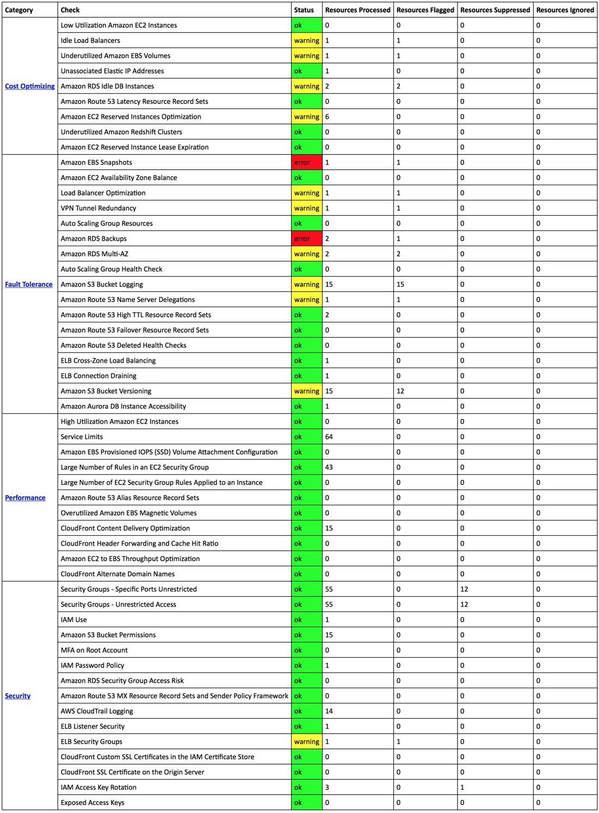

## Get summary of Trusted Advisor Check on daily basis

#### Assumptions:

Expected that you have a verified SES email address

Open `MonitorTrustedAdvisor.py` file and modify the following configuration to appropriate values.

*configuration items*
> to_email = 'noreply@example.com'

> from_email = 'noreply@example.com'

Create two different lambda functions, one for refreshing the check and another for getting the summary of checks.

**Refresh Function:**
Use the following configuration for refresh Lambda function.

* Upload RefereshTrustedAdvisor.py file to Lambda from S3 (or copy the code inline).
* Runtime: Python 2.7
* Handler: RefereshTrustedAdvisor.lambda_handler [Based on the way you upload the code, this might change.]
* Role: Along with the permissions in basic execution role, `trustedadvisor:DescribeCheckItems` & `trustedadvisor:RefreshCheck` permissions are also needed
* Memory: 128MB
* Timeout: 60 seconds

Configure the Lambda function to run every day at 00:05AM (GMT)

Cron expression: `cron(5 0 * * ? *)`

**GetSummary Function:**
Use the following configuration for obtaining TA check summary Lambda function.

* Upload MonitorTrustedAdvisor.py file to Lambda from S3 (or copy the code inline).
* Runtime: Python 2.7
* Handler: MonitorTrustedAdvisor.lambda_handler [Based on the way you upload the code, this might change.]
* Role: Along with the permissions in basic execution role, `trustedadvisor:DescribeCheckItems`, `trustedadvisor:DescribeCheckSummaries` & `ses:SendEmail` permissions are also needed
* Memory: 128MB
* Timeout: 180 seconds

Configure the Lambda function to run every day at 01:05AM (GMT)

Cron expression: `cron(5 1 * * ? *)`

Based on the daily run you will receive an email with summary of checks.

